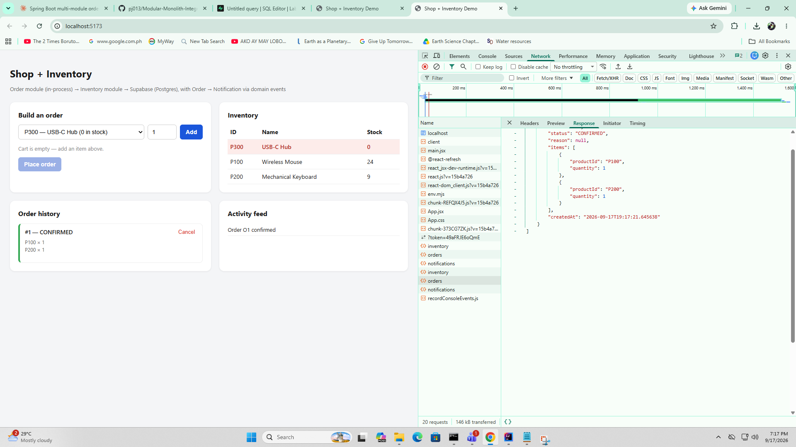
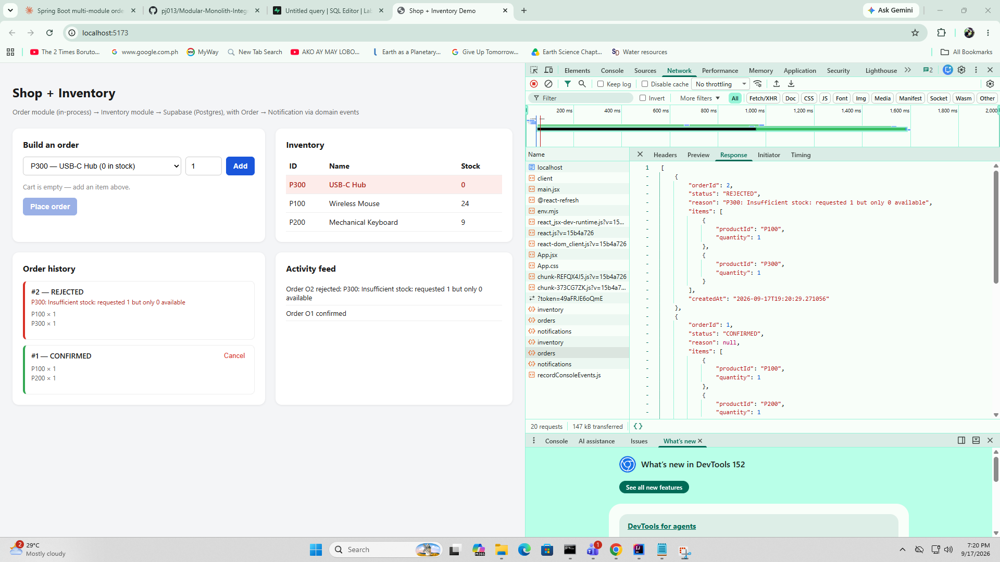
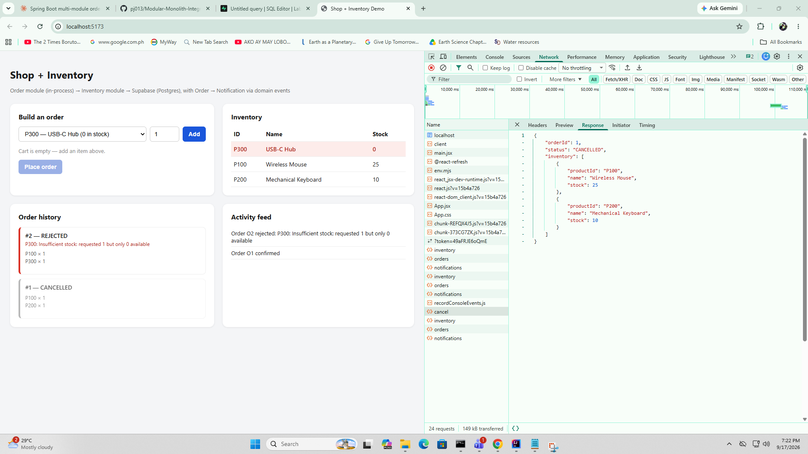
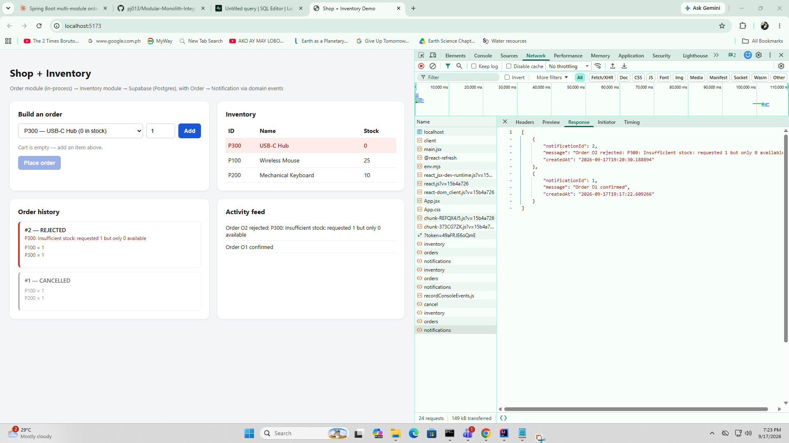

# Shop + Inventory + Notification Demo (Lab 2)

A single Spring Boot app with three in-process modules — **Order** (`edu.cit.aaron.shop`),
**Inventory** (`edu.cit.aaron.inventory`), and **Notification** (`edu.cit.aaron.notification`) —
sharing one Supabase (Postgres) database, plus a React (Vite) frontend over REST.

Builds on Lab 1: same three integration styles (in-process module calls, service-to-database,
external REST client) plus a fourth — in-process publish/subscribe via Spring's
`ApplicationEventPublisher` / `@EventListener`, used for Order/Inventory → Notification.

---

## 1. Create/rebuild the Supabase schema

1. Go to [supabase.com](https://supabase.com) and create a free project (skip if you already
   have one from Lab 1).
2. Open **SQL Editor → New query**, paste the full contents of `db/schema.sql`, and run it.
   This **drops and recreates every table from scratch** — `inventory`, `orders`, the new
   `order_items`, and the new `notifications` — then reseeds:
    - `P100` Wireless Mouse — 25
    - `P200` Mechanical Keyboard — 10
    - `P300` USB-C Hub — 0

   Re-run this any time you want a clean slate; it's idempotent.

## 2. Configure backend credentials (never committed)

Same three required env vars as Lab 1, plus one new optional one:

```
SUPABASE_DB_URL=jdbc:postgresql://<host>:5432/postgres?sslmode=require
SUPABASE_DB_USERNAME=postgres.<project-ref>   # use the Session Pooler username/host if you're IPv4-only
SUPABASE_DB_PASSWORD=<your-db-password>
CORS_ALLOWED_ORIGIN=http://localhost:5173     # optional, this is the default
LOW_STOCK_THRESHOLD=5                          # optional, this is the default
```

Set these in your shell or IDE run configuration — see Lab 1's setup notes if you need the
per-OS `export` / `$env:` commands. `.env` and `application-local.*` stay gitignored.

## 3. Run the backend

```bash
cd backend
mvn spring-boot:run
```

API on `http://localhost:8080`:

| Method | Path | Purpose |
|---|---|---|
| `GET`  | `/api/inventory` | Live stock levels |
| `GET`  | `/api/inventory/{productId}` | Single item |
| `POST` | `/api/orders` | `{ "items": [{ "productId": "P100", "quantity": 2 }, ...] }` → `{ status, reason, items: [{productId, quantity, outcome}], inventory }` |
| `GET`  | `/api/orders` | Order history with line items |
| `POST` | `/api/orders/{orderId}/cancel` | Cancels a `CONFIRMED` order and restocks every line item; `404` if unknown, `409` if already cancelled or was rejected |
| `GET`  | `/api/notifications` | Activity feed (order confirmed/rejected, low-stock alerts) |

## 4. Run the frontend

```bash
cd frontend
npm install
cp .env.example .env   # defaults to http://localhost:8080
npm run dev
```

Open `http://localhost:5173`. The UI is four panels: a cart-based order builder, a live
inventory table (red-highlighted rows below the low-stock threshold), order history with a
Cancel button on confirmed orders, and an activity feed fed by the notifications endpoint.
Inventory/history/feed all refetch after every order submission and every cancel.

## 5. Automated tests

```bash
cd backend
mvn test
```

`OrderServiceTest` covers, against a fake `InventoryService`:
- a multi-item order where every item has stock → `CONFIRMED`, all items reserved
- a multi-item order where one item is short → `REJECTED`, **zero** `reserve()` calls made
  (proves all-or-nothing: nothing partially reserved)
- cancelling a confirmed order → stock restored
- cancelling an already-cancelled order → `OrderConflictException`
- cancelling an unknown order → `OrderNotFoundException`

## 6. Test and capture Network tab evidence for

Open DevTools → **Network** tab before each action, then screenshot the request **Payload**
and **Response**:

1. **Multi-item order, all succeed** — e.g. `{"items":[{"productId":"P100","quantity":2},{"productId":"P200","quantity":1}]}` → `status: "CONFIRMED"`, both items `"outcome": "RESERVED"`.
2. **Multi-item order, one fails → whole order rejected** — e.g. add `P300` (0 stock) alongside `P100` → `status: "REJECTED"`, and a follow-up `GET /api/inventory` shows `P100`'s stock **unchanged** (proves no partial reservation).
3. **Cancel + restock** — cancel the confirmed order from (1), then `GET /api/inventory` again and confirm `P100`/`P200` stock returned to their pre-order values.
4. **Notification feed** — `GET /api/notifications` after the above showing a `"confirmed"` entry, a `"rejected"` entry, and (if you drove `P200` or another item below the threshold) a `"reorder needed"` entry.

## Module boundaries

Three modules, three interfaces, three sets of package-private implementations:

- **Inventory** (`edu.cit.aaron.inventory`): `InventoryService` is public; `InventoryServiceImpl`,
  `InventoryEntity`, `InventoryRepository` are package-private. Order and Notification never see them.
- **Order** (`edu.cit.aaron.shop`): `OrderService` depends only on `InventoryService` (constructor
  injection) and publishes `OrderPlacedEvent` / `OrderRejectedEvent` from `edu.cit.aaron.shop.events`.
  It has no dependency on, or awareness of, the Notification module.
- **Notification** (`edu.cit.aaron.notification`): `NotificationListener` imports **only** the event
  record classes — `edu.cit.aaron.shop.events.OrderPlacedEvent/OrderRejectedEvent` and
  `edu.cit.aaron.inventory.events.LowStockEvent` — never `OrderService` or `InventoryService`.
  `NotificationEntity`/`NotificationRepository` are package-private, same pattern as Inventory.

The event classes live in their own `events` sub-packages (`shop.events`, `inventory.events`) rather
than in `notification` itself — that's what keeps the dependency one-directional: Notification depends
on Order/Inventory's published event *shapes*, but Order/Inventory have zero dependency on Notification
and would compile and run identically if the Notification module were deleted entirely.

## Why the event listeners are NOT `@Async`

`NotificationListener`'s three `@EventListener` methods run synchronously, on purpose:

- `OrderService.placeOrder()` and `cancelOrder()` are `@Transactional`. A plain (non-`@TransactionalEventListener`)
  `@EventListener` fires synchronously on the same thread, inside that same transaction — so the
  notification `INSERT` commits or rolls back atomically with the order/inventory writes. If the order
  write somehow failed after the event fired, the notification row would roll back with it; nothing gets
  logged for a write that didn't actually happen.
- Making it `@Async` would move the write to a separate thread/transaction. That breaks the atomicity
  above (the notification could commit even if the surrounding order transaction later rolled back, or
  vice versa) and, since `ApplicationEventPublisher` doesn't wait for async listeners, an unhandled
  exception in the listener would be silently swallowed on a background thread instead of surfacing.
- For this lab's scale (single low-latency DB write per event, no slow I/O like sending an email or
  calling an external API), synchronous is simpler and strictly safer. If Notification's listener ever
  did something slow or unreliable (e.g. calling a third-party push-notification API), `@Async` — with
  its own error handling and probably `@TransactionalEventListener(phase = AFTER_COMMIT)` instead of
  `@EventListener` — would be the right call, precisely to stop a slow/flaky notification from blocking
  or failing the order itself.

## Database schema

```
inventory      product_id (PK), name, stock
orders         order_id (PK), status (CONFIRMED|REJECTED|CANCELLED), reason, created_at
order_items    order_item_id (PK), order_id (FK -> orders), product_id (FK -> inventory), quantity
notifications  notification_id (PK), message, created_at
```

`db/schema.sql` drops and recreates all four tables plus seed data — it's the single source of
truth for the schema, never hand-edited in the Supabase UI.

## Known limitation: validate-then-reserve race window

`OrderService.placeOrder()` validates every line item's stock (read), and only if *all* pass does
it call `InventoryService.reserve()` for each (write) — both inside one `@Transactional` method.
Between the read and the write, a **concurrent** order for the same product could theoretically
change the stock level, since Postgres's default `READ COMMITTED` isolation doesn't lock rows across
that gap. For this lab (single-user manual testing) that's not observable, and if it ever did happen,
`OrderService` throws on an unexpected `reserve()` failure, which rolls back the whole transaction
(including any items already reserved earlier in the same loop) rather than silently partially
fulfilling the order. A production system would close this gap with `SELECT ... FOR UPDATE` or an
optimistic-locking `@Version` column on `inventory`.

## Project layout
## Screen Shot
1. A multi-item order where all items succeed (CONFIRMED)

2. A multi-item order where one item fails and the whole order is REJECTED with no partial reservation

3. A cancel with restock reflected in GET /api/inventory afterward

4. The notification feed showing a confirmed order, a rejected order, and a low-stock alert


## Reflection
1. Right now when I place a multi-item order, OrderService calls InventoryService.reserve() once per line item, but all of that happens inside one @Transactional method. That's really the whole trick — Spring wraps the entire method in a single database transaction, so even though I'm calling reserve() three or four times in a loop, all of those stock updates either commit together or none of them do. If the third item in the loop somehow fails after the first two already succeeded, I throw an exception and the whole transaction rolls back, so items one and two get "un-reserved" automatically. I don't have to write any of that rollback logic myself — the JVM and the DB transaction give it to me for free because everything is happening in one process against one connection.
If Order and Inventory were split into separate services talking over a network, I'd lose that for-free guarantee immediately, because there's no longer one shared database transaction — Order would have its own DB and Inventory would have its own DB. I'd need something like a saga: reserve each item one at a time via network calls, and if any of them fails partway through, explicitly call a compensating "release" or "undo-reservation" action on every item that already succeeded. That's a lot more code, and it's not even instant — there's a window where the order looks partially reserved until the compensation finishes.
2. Publishing OrderPlacedEvent instead of calling a NotificationService.notify() method directly means OrderService doesn't know Notification exists at all. It's not "I coupled to an interface" like with Inventory — it's zero coupling. I could delete the entire notification package and Order would still compile and run fine, just with nobody listening. That's a much looser relationship than the Order → Inventory one
If Notification became its own microservice, I'd need a real message broker (Kafka, RabbitMQ, SQS, something like that) instead of Spring's in-memory ApplicationEventPublisher, since events can't just be method calls anymore. I'd also have to actually think about delivery guarantees — right now if the JVM crashes mid-event, that's a shared failure with everything else in the process, but over a network I'd have to decide if it's okay to lose a notification occasionally (at-most-once) or if I need retries/deduplication (at-least-once), which usually means an outbox table so the event doesn't just vanish if the broker call fails right after the DB commit.
3. Honestly I'd pick Notification. It already has the loosest coupling of the three (nobody calls into it, it only listens), and it's the least critical if it's slow or briefly down — nobody's order fails if a notification is late. Inventory would be way riskier to extract first because Order needs a real-time, consistent answer from it on every single order. To actually split Notification out, OrderService and InventoryServiceImpl wouldn't change at all — they'd keep publishing the same events. The event publishing mechanism itself would have to change under the hood (from ApplicationEventPublisher to actually pushing to a broker), and I'd write a small adapter that listens for the in-process event and forwards it externally, so the module boundary I already built pays off immediately.

```
backend/
  src/main/java/edu/cit/aaron/
    ShopApplication.java          # @SpringBootApplication, scans all three modules
    shop/                         # Order module
      events/                    # OrderPlacedEvent, OrderRejectedEvent
    inventory/                    # Inventory module
      events/                    # LowStockEvent
    notification/                # Notification module
    common/                      # CORS config, exception handling
  src/main/resources/application.properties
  src/test/java/edu/cit/aaron/shop/OrderServiceTest.java
db/
  schema.sql                      # run in Supabase SQL editor - drops & recreates everything
frontend/
  src/App.jsx                     # cart, inventory dashboard, order history, notification feed
```
