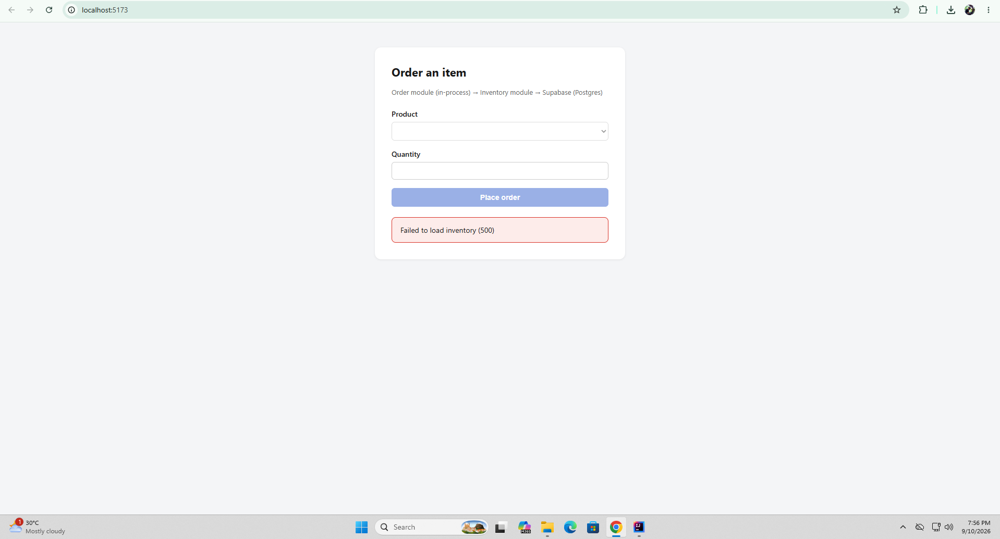
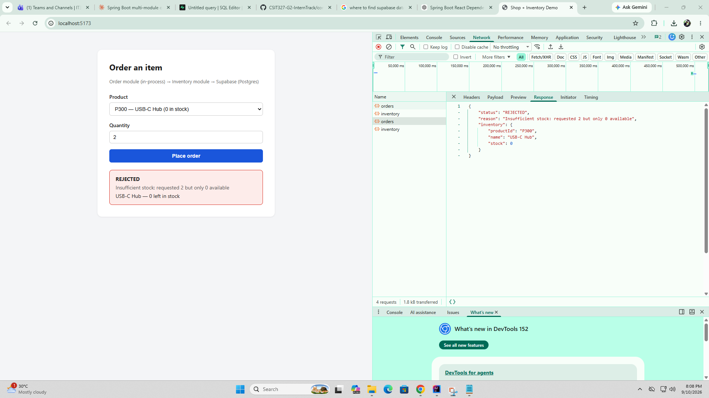

# Shop + Inventory Demo

A single Spring Boot app with two in-process modules — **Order** (`edu.cit.aaron.shop`)
and **Inventory** (`edu.cit.aaron.inventory`) — sharing one Supabase (Postgres) database,
plus a React (Vite) frontend that talks to it over REST.

Packages: `edu.cit.aaron.shop` (Order module) and `edu.cit.aaron.inventory` (Inventory module).

---

## 1. Create the Supabase project

1. Go to [supabase.com](https://supabase.com), create a free project.
2. Open **SQL Editor → New query**, paste the contents of `db/schema.sql`, and run it.
   This creates `inventory` and `orders` and seeds:
   - `P100` Wireless Mouse — 25
   - `P200` Mechanical Keyboard — 10
   - `P300` USB-C Hub — 0
3. Go to **Project Settings → Database** and copy:
   - Host (use the pooler host if you're on IPv4-only)
   - Database password
   - Port (5432 for direct connection, 6543 for the transaction pooler)

## 2. Configure backend credentials (never committed)

The backend reads three environment variables — see `backend/.env.example`:

```
SUPABASE_DB_URL=jdbc:postgresql://<host>:5432/postgres?sslmode=require
SUPABASE_DB_USERNAME=postgres
SUPABASE_DB_PASSWORD=<your-db-password>
CORS_ALLOWED_ORIGIN=http://localhost:5173   # optional, this is the default
```

Set these in your shell before running, or in your IDE's run configuration. Both
`.env` and `application-local.*` are gitignored if you choose to keep a local copy.

macOS/Linux:
```bash
export SUPABASE_DB_URL="jdbc:postgresql://<host>:5432/postgres?sslmode=require"
export SUPABASE_DB_USERNAME="postgres"
export SUPABASE_DB_PASSWORD="<your-db-password>"
```

Windows (PowerShell):
```powershell
$env:SUPABASE_DB_URL="jdbc:postgresql://<host>:5432/postgres?sslmode=require"
$env:SUPABASE_DB_USERNAME="postgres"
$env:SUPABASE_DB_PASSWORD="<your-db-password>"
```

## 3. Run the backend

```bash
cd backend
./mvnw spring-boot:run
```

(No `mvnw` wrapper is bundled here — either run `mvn spring-boot:run` with a local
Maven install, or generate the wrapper with `mvn -N io.takari:maven:wrapper`.)

The API listens on `http://localhost:8080`.

- `GET  /api/inventory` — list of items (used by the frontend dropdown)
- `POST /api/orders` — body `{ "productId": "P100", "quantity": 2 }`,
  returns `{ "status": "CONFIRMED" | "REJECTED", "reason": "...", "inventory": {...} }`

## 4. Run the frontend

```bash
cd frontend
npm install
cp .env.example .env   # defaults to http://localhost:8080, edit if needed
npm run dev
```

Open `http://localhost:5173`.

## 5. Test both paths end-to-end

With the seeded data:

- **CONFIRMED**: pick `P100` (25 in stock), quantity `2` → order goes through,
  stock drops to 23.
- **REJECTED**: pick `P300` (0 in stock), quantity `1` → request is rejected
  with reason "Insufficient stock...", stock stays at 0.

For each, open DevTools → **Network** tab before submitting, click the
`orders` request, and screenshot the **Payload** and **Response** — that's your
evidence of the confirmed and rejected paths working over the network.

You can also verify at the DB level in Supabase's **Table Editor**: the `orders`
table should show one row per attempt (`CONFIRMED` and `REJECTED` both get
logged), and `inventory.stock` should only decrease on confirmed orders.

## 6. Automated tests

```bash
cd backend
mvn test
```

`OrderServiceTest` exercises both the confirmed and rejected paths against a
fake `InventoryService`, proving `OrderService` only needs the interface —
it never touches `InventoryServiceImpl` or the JPA entities behind it.

## Module boundary

- `InventoryService` (interface) — public, lives in `edu.cit.aaron.inventory`.
- `InventoryServiceImpl` — package-private, same package, implements the interface.
- `OrderService` (Order module) takes an `InventoryService` via constructor
  injection. It cannot see `InventoryServiceImpl`, `InventoryEntity`, or
  `InventoryRepository` — they simply aren't visible outside their package.
  Spring wires the concrete impl in at runtime.

## Project layout

```
backend/
  src/main/java/edu/cit/aaron/
    ShopApplication.java          # @SpringBootApplication, scans both modules
    shop/                         # Order module
    inventory/                    # Inventory module
    common/                       # CORS config, exception handling
  src/main/resources/application.yml
  src/test/java/edu/cit/aaron/shop/OrderServiceTest.java
db/
  schema.sql                      # run once in Supabase SQL editor
frontend/
  src/App.jsx                     # dropdown, quantity input, submit, result area
```
Network Tab Evidence

Screenshots go here — capture both requests from Chrome/Edge DevTools → Network tab → click the orders request → Headers, Payload, and Response panes.

Confirmed order

Product: P100 (Wireless Mouse, 25 in stock), quantity 2.

Request Payload:
{ "productId": "P100", "quantity": 2 }

Response (200 OK):
{ "status": "CONFIRMED", "reason": null, "inventory": { "productId": "P100", "name": "Wireless Mouse", "stock": 23 } }



Rejected order

Product: P300 (USB-C Hub, 0 in stock), quantity 1.
Request Payload:
{ "productId": "P300", "quantity": 1 }

Response (200 OK):
{ "status": "REJECTED", "reason": "Insufficient stock: requested 1 but only 0 available", "inventory": { "productId": "P300", "name": "USB-C Hub", "stock": 0 } }



Reflection

1. In-process modules vs. separate microservices over a network

Right now, OrderService calling InventoryService.reserve(...) is a plain Java method call inside one JVM — it's synchronous, shares the same transaction, and either both the order write and the stock decrement happen together or neither does (see @Transactional on OrderService.placeOrder). I get this consistency, low latency, and simple error handling for free: if reserve() throws, the whole method unwinds and nothing gets half-committed. What I'm not getting for free is deployability — I can't scale or redeploy Inventory independently of Order, because they're the same process.

If I split Inventory out into its own service reachable over HTTP/gRPC, I'd have to add back everything the JVM boundary currently gives me implicitly: a real network client with timeouts and retries, serialization/deserialization of the DTOs, service discovery or a fixed URL/config for where Inventory lives, and a strategy for partial failure — e.g. what happens if the order gets written but the network call to reserve stock times out? I'd likely need either a saga/ compensating-transaction pattern or an outbox to keep the two data stores eventually consistent, since a single ACID transaction across two databases isn't realistic anymore.

2. Why InventoryServiceImpl is package-private

Making InventoryServiceImpl package-private (not public) is what actually enforces the module boundary instead of just documenting it in a README. If it were public, nothing would stop OrderService — or any future class — from new InventoryServiceImpl(...)-ing it directly, bypassing Spring's DI and coupling Order to Inventory's persistence details (the JPA entity, the repository, the exact constructor signature). That coupling is exactly what makes a future extraction into a separate service hard: every direct reference to the impl is a wire that has to be cut later. With InventoryServiceImpl invisible outside its package, the compiler itself guarantees Order can only ever depend on the InventoryService interface — the boundary can't rot as the codebase grows, because Java won't let it.

3. When to actually extract Inventory into its own microservice

I'd consider it once Inventory has different scaling, deployment, or ownership needs than Order — e.g. a different team owns it, it needs to scale independently under heavy read traffic, or it needs its own release cadence. Code-wise, the interface (InventoryService, InventoryItemDto, ReservationResult) stays almost identical; that's the whole point of coding to the interface now. What changes is the implementation: I'd write a new InventoryServiceImpl (or a differently named adapter) that calls Inventory's REST/gRPC API instead of a JpaRepository, handles network failures and timeouts, and probably introduces an outbox or idempotency key on reserve() so retries after a timeout don't double-deduct stock. OrderService itself wouldn't need to change at all.

